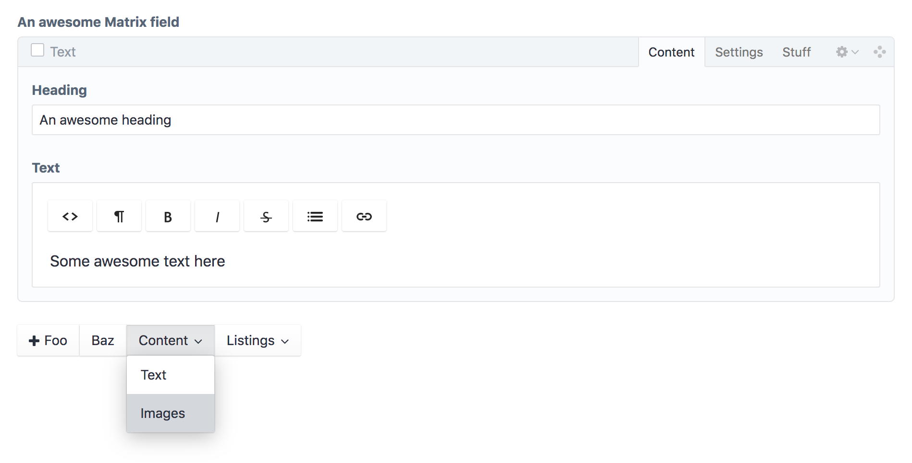

# MatrixMate plugin for Craft CMS

Welding Matrix into shape, mate!  


## Requirements

This plugin requires Craft CMS 4.0.0 or later.  

‼️MatrixMate has been retired and will not be available for Craft 5. See [this issue](#https://github.com/vaersaagod/matrixmate/issues/72) for more info.  

## Installation

To install the plugin, either install it from the plugin store, or follow these instructions:

1. Install with composer via `composer require vaersaagod/matrixmate` from your project directory.
2. Install the plugin in the Craft Control Panel under Settings -> Plugins, or from the command line via `./craft plugin/install matrixmate`.
3. For MatrixMate to do anything, you need to [configure it](#configuring-matrixmate). But first, continue reading!

---

## MatrixMate overview

MatrixMate enables you to improve the Matrix authoring experience by sorting block types into _groups_ and block type fields into _tabs_.  

Additionally, MatrixMate offers these nifty features:  

* Maximum limits can be set per block type
* Ungrouped block types can be hidden, or displayed as native Matrix buttons  
* A single block type can be added to multiple groups (sometimes it makes sense!)
* Block types can be explicitly hidden, even without using the grouping feature  
* A single Matrix field can be configured differently for different contexts (e.g. sections, entry types, category groups etc)  

  

### I can't believe it's not Pimp My Matrix!

MatrixMate began life as a fork of famed Craft plugin [Pimp My Matrix](https://github.com/angell-co/Pimp-My-Matrix/) (aka [Spoon](https://github.com/angell-co/Spoon) for Craft 3), and we give big props to its author [Josh Angell](https://github.com/angell-co) for inspiring MatrixMate.  

The featureset overlap between Spoon and MatrixMate is pretty obvious, but a big difference is that unlike Spoon, MatrixMate does *not* feature a field configuration UI inside Craft's Control Panel. Instead, MatrixMate is completely configured using a PHP config file.  

[Read more about configuring MatrixMate here](#configuring-matrixmate)  

### Nested Matrix fields 

MatrixMate does *not* support Matrix fields that are nested in other fieldtypes (e.g. SuperTable). If you need SuperTable support, you should consider using [Spoon](https://github.com/angell-co/Spoon) instead.  

---

## Configuring MatrixMate

MatrixMate is configured by creating a config file named `matrixmate.php` in your Craft config folder (i.e. where your `general.php` and `db.php` files sit).

The config file should look something like this:   

```php
<?php

return [
    'fields' => [
        'matrixFieldHandle' => [
            'groups' => [[
                'label' => 'Content',
                'types' => ['text', 'images', 'video'],
            ], [
                'label' => 'Listings',
                'types' => ['news', 'employees'],
            ]],
            'types' => [
                'text' => [
                    'tabs' => [[
                        'label' => 'Text',
                        'fields' => ['heading', 'text'],
                    ], [
                        'label' => 'Settings',
                        'fields' => ['columns'],
                    ]],
                    'hiddenFields' => ['backgroundColor', 'textColor'],
                ],
                'news' => [
                    'maxLimit' => 1,
                ],
            ],
        ],
        'anotherMatrixFieldHandle' => [
            ...
        ],
    ],
];
```

To explain what the above example would do:  

For a Matrix field with the handle `matrixFieldHandle`, the above configuration would create two block type groups called "Content" and "Listings". The fields inside the `text` block type would be sorted into two tabs called "Text" and "Settings", and the `news` block type would be limited to a single block, using the `maxLimit` setting.  

Additionally, two fields called `backgroundColor` and `textColor` in the `text` block type are *hidden*, using the `hiddenFields` setting (added in MatrixMate v. 1.2.0).  

For a more detailed overview of the different settings available when configuring MatrixMate, see the [Configuration settings](#configuration-settings) section.  

### Config contexts

By default, a MatrixMate field config will apply everywhere that the field is used. However, you can use _context keys_ to apply different configs for the same field across different types of content:  

```php
<?php

return [
    'fields' => [
        'matrixFieldHandle' => [ 
            '*' => [
                'groups' => [
                    ...
                ],
            ],
            'section:news,section:blog' => [
                'groups' => [
                    ...
                ],
            ],
        ],
    ],
];
```

The above example would apply a specific configuration for a Matrix field with the handle "matrixFieldHandle" when that field is used in entries belonging to the sections `news` and `blog` (note that a comma separated list is used to apply the same configuration to multiple contexts).  

Additionally, a "global" config that will apply everywhere else is added using the asterisk (`*`) key. The global config is completely optional - it's totally fine to only have specific context keys declared (in which case the Matrix field will render natively; i.e. without any modifications, everywhere else).    

#### Supported contexts

`section:{handle}` - Apply for all entry types in a particular section  
`entryType:{handle}` - Apply for entries with a particular entry type  
`categoryGroup:{handle}` - Apply for categories in a particular category group  
`globalSet:{handle}` - Apply for a particular global set  
`volume:{handle}` - Apply for assets in a particular volume  
`users` - Apply for user account edit pages  
`productType:{handle}` - Apply for Commerce products with a particular product type

#### Config context inheritance

‼️ MatrixMate config contexts are **not** recursively merged – unlike, for example, Craft's multi-environment configs. This means that if you have a global config context (i.e. `*`) and a context targeting, for example, a specific section (e.g. `'section:news'`), the settings for the global config are **not** inherited by that `'section:news'` context. Essentially, you start fresh for every context. This is not a bug, but a feature!  

...in cases where you'd prefer that config contexts were merged, you can work around this behavior by adding a bit of PHP logic to the config file:  

```php
<?php

$globalConfig = [
    'groups' => [
        ...
    ],
];

return [
    'fields' => [
        'matrixFieldHandle' => [ 
            '*' => $globalConfig,
            'section:news,section:blog' => array_merge_recursive($globalConfig, [
                'groups' => [
                    ...
                ],
            ]),
        ],
    ],
];
```

### Configuration settings

The below settings apply to a Matrix field configuration, e.g.  

```php
<?php

return [
    'fields' => [
        'matrixFieldHandle' => [
            // Field configuration here
        ],
    ],
];
```

#### defaultTabName [string|bool]
*Default: `'Fields'`*  

If any of the block types in a field config is setup with custom tabs, MatrixMate will put any fields that *isn't* added to a tab into a "default" tab called "Fields". To change the name for the default tab, add a key called `'defaultTabName'` to the field config:  

```php
<?php

return [
    'fields' => [
        'matrixFieldHandle' => [
            'defaultTabName' => 'Misc',
        ],
    ],
];
```

To *not* render any default tabs (effectively _hiding_ all fields that aren't put into tabs), `defaultTabName` can be set to `false`:  

```php
<?php

return [
    'fields' => [
        'matrixFieldHandle' => [
            'defaultTabName' => false,
        ],
    ],
];
```

This setting only applies to block types that are configured to use tabs, and can be overridden on a per-type basis (see `'types'` config section below).    

#### defaultTabFirst [bool]
*Default: `false`*  

By default, the default tab will render *after* any custom tabs. To put the default tab first, set `defaultTabFirst` to `true`.  

```php
<?php

return [
    'fields' => [
        'matrixFieldHandle' => [
            ...
            'defaultTabName' => 'Misc',
            'defaultTabFirst' => true,
        ],
    ],
];
```

#### groups [array]

Block types can be _grouped_ by adding a key `'groups'` to a field configuration.  

A single group is declared by adding an associate array to `'groups'`, containing the keys `'label'` (string, the name of the group) and `'types'` (array with the handles for the block types the group should contain):  

```php
...
'matrixFieldHandle' => [
    'groups' => [[
        'label' => 'Content',
        'types' => ['text', 'heading'],
    ], [
        'label' => 'Misc',
        'types' => ['newsletter', 'feed'],
    ]],
],
```

Note that empty groups (or groups containing a `types` array without any actual/valid block type handles) as well as groups missing labels, will not be rendered.  

#### types [array]

Using the `'types'` key in a field configuration enables you to sort block type fields into _tabs_, and/or add a maximum limit to the number of instances a particular block type is allowed to have.   

The `'types'` array should use relevant block types' handles as keys, with each block type's configuration as an array for the values:  

```php
...
'matrixFieldHandle' => [
    'types' => [
        'text' => [
            // Block type config here
        ],
        'news' => [
            // Block type config here
        ],
    ],
],
```

##### Creating tabs

To sort a block type's fields into tabs, add a key called `'tabs'` to a block type's configuration inside the `'types'` array. Each tab should be an associative array with the keys `'label'` (string; the tab's title) and `'fields'` (an array containing the handles for the fields belonging to this tab):  

```php 
...
'types' => [
    'text' => [
        'tabs' => [[
            'label' => 'Content',
            'fields' => ['heading', 'text'],
        ], [
            'label' => 'Settings',
            'fields' => ['columns'],
        ]],
    ],
],
```

The above example would sort the fields `heading`, `text` and `columns` into two tabs; "Content" and "Settings".    

The order of the fields inside the `'fields'` array doesn't matter, as MatrixMate will not reorder the fields - it will simply hide and show them depending on which tab is currently active.  

Tabs missing labels or that have an empty `'fields'` array (or an array without any valid field handles) will not display. If only a single valid tab is found in the config, no tabs will be rendered.  

When custom tabs have been added, Any fields belonging to a particular field that is *not* added to a tab, will be put into a "default" tab called "Fields". See the next section for details.

##### Changing the default tab name (or hiding the default tab completely) for a block type

When using the `'tabs'` setting to add custom tabs, MatrixMate will put any fields that haven't been added to a tab into a "default" tab called "Fields". To change the name for the default tab, add a key called `'defaultTabName'` to the relevant block type's config:   

```php 
...
'types' => [
    'text' => [
        'tabs' => [[
            'label' => 'Content',
            'fields' => ['heading', 'text'],
        ], [
            'label' => 'Settings',
            'fields' => ['columns'],
        ]],
        'defaultTabName' => 'Misc',
    ],
],
```

To *not* render a default tab - in effect, hiding any fields that don't belong to a custom tab - set `'defaultTabName'` to `false`:   

```php 
...
'types' => [
    'text' => [
        'tabs' => [[
            'label' => 'Content',
            'fields' => ['heading', 'text'],
        ], [
            'label' => 'Settings',
            'fields' => ['columns'],
        ]],
        'defaultTabName' => false,
    ],
],
```

Adding a `'defaultTabName'` setting to a block type config will override the same setting set on field level.  

##### Max limit

To set a maximum limit for a particular type, add a key called `'maxLimit'` to that type's config:  

```php 
...
'types' => [
    ...
    'news' => [
        'maxLimit' => 1,
    ],
],
```

##### Hide fields

To hide specific fields within a block type's config, use the `hiddenFields` setting (should be an array of field handles):  
```php 
...
'types' => [
    ...
    'text' => [
        'hiddenFields' => ['backgroundColor', 'textColor'],
    ],
],
```
Note that any field in `hiddenFields` will be hidden, even if that field is also added to a tab.  

_Take care not to hide required fields!_ MatrixMate does not include any functionality to account for required fields that are hidden, so hiding a required field would make it impossible for the content editor to actually save the block.  


#### hideUngroupedTypes [bool]
*Default: `false`*  

By default, MatrixMate will render native Matrix buttons for any block types that don't belong to a group. To _hide_ all ungrouped block types instead, set `hideUngroupedTypes` to `true`:   

```php
...
'matrixFieldHandle' => [
    'groups' => [...],
    'hideUngroupedTypes' => true,
],
```

This setting only applies when using the grouping feature.  

#### hiddenTypes [array]

To explicitly hide one or several block types, add an array of block type handles to a key `hiddenTypes`:  

```php
...
'matrixFieldHandle' => [
    'hiddenTypes' => ['newsletter', 'feed'],
],
```

This setting will hide any and all block types added to it, regardless of whether those types have been added to any groups or not, and regardless of the value for the `hideUngroupedTypes` setting.

#### ungroupedTypesPosition [string]
*Default: `'before'`*

If set to `'after'`, buttons for ungrouped block types will render _after_ the group buttons.

```php
...
'matrixFieldHandle' => [
    'groups' => [...],
    'ungroupedTypesPosition' => 'after',
],
```

This setting only applies when using the grouping feature.  

### Advanced configuration

*Danger Zone*  

This is an aside, but since the `config/matrixmate.php` file is just PHP, you _can_ of course go nuts with logic to concoct whatever complex setup you require. As a simple example, here's how you could go about rendering a particular config only if the currently logged in user is *not* an admin user:

```php
<?php

$isUserAdmin = Craft::$app->getUser()->admin;

return [
    'fields' => [
        'matrixFieldHandle' => [ 
            ...
            'section:news,section:blog' => !$isUserAdmin ? [
                'groups' => [
                    ...
                ],
            ] : null,
        ],
    ],
];
```

Obviously, putting logic inside a config file like the above is potentially A Very Bad Idea and can easily introduce performance issues or other bugs in your application.  

If you do add logic to the config file that is potentially taxing (code resulting in a lot of database queries, for instance), you should consider using Craft's cache component (i.e. `Craft::$app->getCache()`) where applicable. You can also consider _disabling MatrixMate completely for non-CP requests_, using Craft's [`disabledPlugins`](https://docs.craftcms.com/api/v3/craft-config-generalconfig.html#disabledplugins) config setting in `config/general.php`, e.g. by doing something like this:  

```php
<?php

$isCpRequest = \explode('/', \parse_url($_SERVER['REQUEST_URI'], PHP_URL_PATH))[1] ?? null === 'admin';

return [
    '*' => [
        ...
        'disabledPlugins' => \array_filter([!$isCpRequest ? 'matrixmate' : null]),
    ],
    ...
];
```

Note: Even if the MatrixMate plugin is not relevant for frontend requests, doing something like the above is a totally unneccessary micro-optimization unless you do have some heavy, custom logic in your `config/matrixmate.php` config file.  

---

## Translating MatrixMate

All the configured user-facing text strings, like tab and group labels, will be translated using the `'site'` static translation category.  

## Price, license and support

The plugin is released under the [MIT license](https://raw.githubusercontent.com/vaersaagod/matrixmate/master/LICENSE.md), meaning you can do what ever you want with it as long as you don't blame us (and honor the original license). **It's free**, which means there is absolutely no support included, but you might get it anyway. Just post an issue here on GitHub if you have one, and we'll see what we can do. 

## Changelog

See [CHANGELOG.MD](https://raw.githubusercontent.com/vaersaagod/matrixmate/master/CHANGELOG.md).

## Credits

Brought to you by [Værsågod](https://www.vaersaagod.no)

Icon designed by [Freepik from Flaticon](https://www.flaticon.com/authors/freepik).
